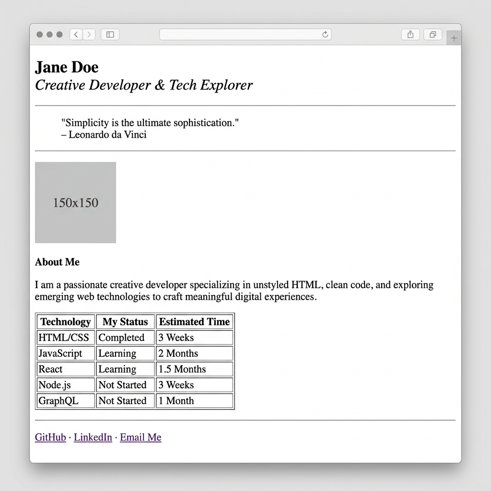

# HTML for Complete Beginners

Welcome to the **HTML for Complete Beginners** course! This is a step-by-step, plain-text guide designed to help you build your very first webpage from absolute scratch. 

We will focus entirely on core structure and basic tags. You won't have to worry about any complex styling (CSS) or programming logic (JavaScript) yet. Just pure HTML, simple structures, and clear results.

---

## What You Will Build

Below is a preview of the clean, structured personal homepage you will build by the end of this course, using only plain HTML:

---

### **Start here:** [Step 1: Overview →](docs/step-01-overview.md)

---

## Course Table of Contents

| Step | Topic | What You'll Learn |
| :--- | :--- | :--- |
| 01 | [Overview & Setup](docs/step-01-overview.md) | What HTML is, what web browsers do, and setting up your workspace. |
| 02 | [Basic Document Skeleton](docs/step-02-structure.md) | Understanding `<html>`, `<head>`, `<title>`, and `<body>`. |
| 03 | [Formatting Text](docs/step-03-text.md) | Creating headings (`<h1>`-`<h6>`) and paragraphs (`
`). |
| 04 | [Structuring with Containers](docs/step-04-containers.md) | Using `
` blocks to organize your page sections. |
| 05 | [Adding Links & Images](docs/step-05-links-images.md) | Linking pages together (`<a>`) and embedding images (``). |
| 06 | [Final Practical Project](docs/step-06-practice.md) | Putting everything together into a clean, simple personal webpage. |

## Course Rules
* **No CSS or Styling:** We are focusing on learning HTML tags and semantic structures.
* **Hands-on practice:** Follow along and type the code out yourself to build muscle memory.
* **Visual Verification:** Check the provided code screenshots and browser previews in each lesson to ensure you're on the right track!
