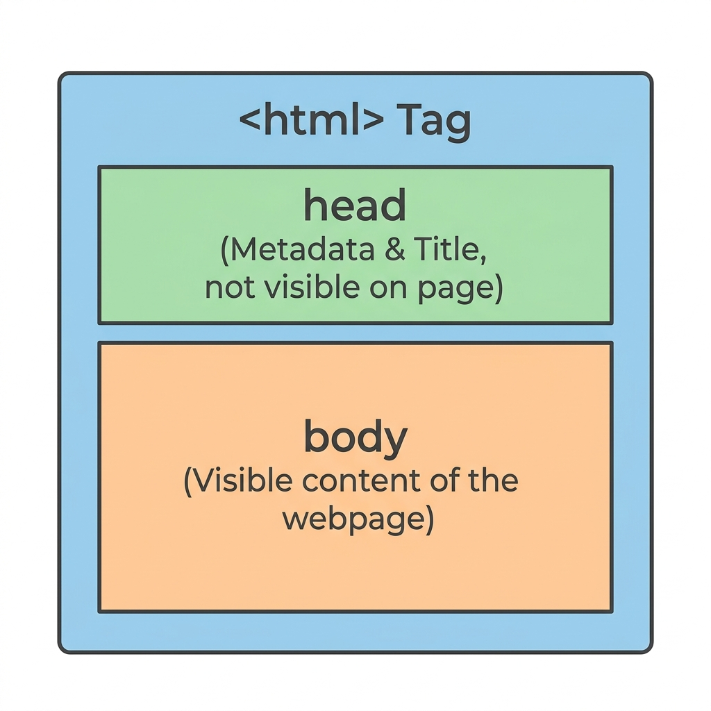

[← Back to README](../README.md) · [Next: Document Skeleton →](step-02-skeleton.md)

# Step 1: Overview & Setup

Welcome to the first step of your HTML learning journey! 

## What is HTML?

**HTML** stands for **HyperText Markup Language**.
* **HyperText** refers to text that contains links to other text, allowing you to click around the web.
* **Markup Language** means it uses special codes (called tags) to label and structure text. For example, you can tell the browser, "This text is a heading," or "This text is a paragraph."

HTML is the absolute foundation of all websites.

---

## Nesting HTML Boxes

HTML documents are built like nested boxes (parents and children):

1. <strong>`<html>` (Core):</strong> Encloses the entire webpage.
2. <strong>`<head>` (Metadata):</strong> Contains instructions for the browser (like the page title). Invisible to users.
3. <strong>`<body>` (Content):</strong> Contains all visible page contents (headings, text, images).

---

## Setup Your Project

1. Open your text editor.
2. Create a new file.
3. Save it as `index.html` in your project folder.
   > [!IMPORTANT]
   > Make sure the file extension is `.html`, not `.txt`.

---

[← Back to README](../README.md) · [Next: Document Skeleton →](step-02-skeleton.md)
