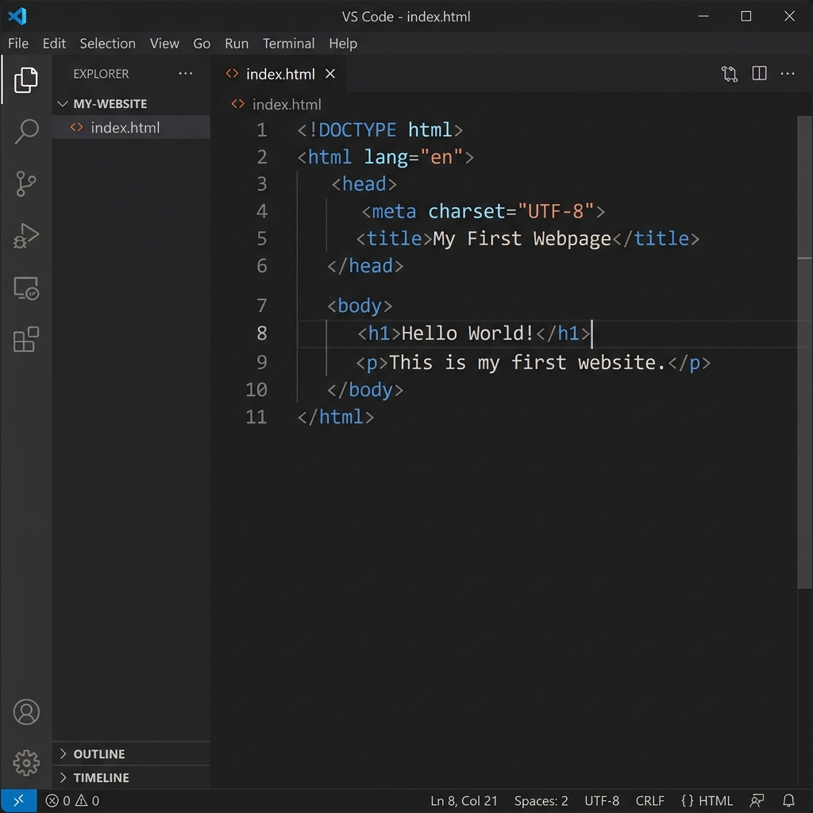

[← Back to README](../README.md) · [Next: Formatting Text →](step-03-text.md)

# Step 2: Basic Document Skeleton

Every standard HTML webpage requires a specific set of tags to help the browser understand the code. Think of this as the "skeleton" or boilerplate code.

In this step, you will write the basic structure of your page.

---

## The Boilerplate Code

Type this code exactly into your `index.html` file:

```html
<!DOCTYPE html>
<html>
  <head>
    <title>My First Webpage</title>
  </head>
  <body>
    Hello World!
  </body>
</html>
```

Here is a screenshot of what this looks like inside a text editor:



---

## Tag Explanations

Let's break down each element you just typed:

### 1. `<!DOCTYPE html>`
* **What it does:** This is a declaration that tells the web browser that this file is a modern **HTML5** document.
* **Note:** It does not need a closing tag.

### 2. `<html>` and `</html>`
* **What it does:** The root container that wraps all your HTML code. Every tag you write (except the DOCTYPE) must live between `<html>` and `</html>`.

### 3. `<head>` and `</head>`
* **What it does:** Contains metadata about the page. This information is processed by the browser behind the scenes.
* **Important children:** The `<title>` tag lives inside `<head>`.

### 4. `<title>` and `</title>`
* **What it does:** Defines the title of the webpage. This is the text displayed on your browser's tab (e.g., "My First Webpage").

### 5. `<body>` and `</body>`
* **What it does:** Contains all the visible contents of the website. Anything you want the user to see—text, headers, buttons, layout containers—goes between `<body>` and `</body>`.

---

## Hands-On Exercise
1. Copy or type the boilerplate code into your `index.html` file.
2. Save the file.
3. Find the file on your computer and double-click it. It will open in your web browser.
4. You should see a blank screen with the text **Hello World!** in the top-left corner, and the title tab should read **My First Webpage**.

---

[← Back to README](../README.md) · [Next: Formatting Text →](step-03-text.md)
