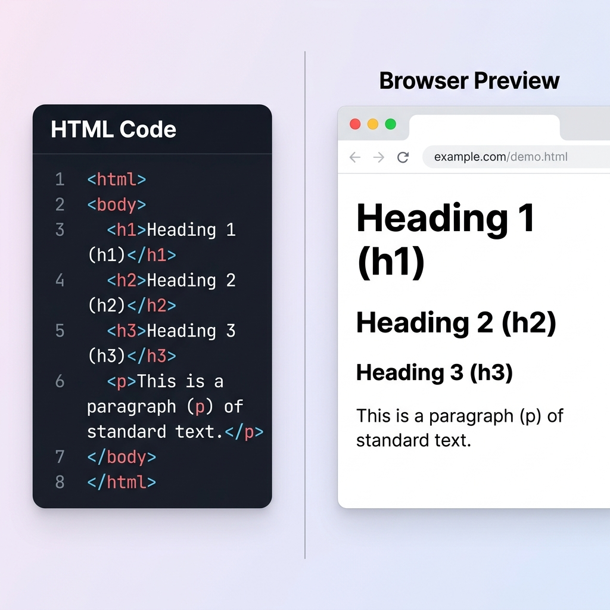

[← Back to README](../README.md) · [Next: Structuring with Containers →](step-04-containers.md)

# Step 3: Formatting Text

Now that we have our document skeleton ready, let's start adding visible text content to our page. To do this, we will use headings and paragraph tags.

Since you are building a website about yourself, we will write a personal name heading and an introductory bio paragraph.

---

## Headings (`<h1>` to `<h6>`)

HTML headings are used to define the titles and subtitles of a page. There are six levels of headings, starting from `<h1>` (the most important) to `<h6>` (the least important).

* **`<h1>`:** Typically used for the main title of the page (like your name).
* **`<h2>`:** Used for major sections (like "About Me" or "My Skills").
* **`<h3>` to `<h6>`:** Used for sub-sections.

### Code Example:
```html
<h1>Your Name Here</h1>
<h2>About Me</h2>
<h3>My Coding Goals</h3>
```

---

## Paragraphs (`<p>`)

The `<p>` tag is used to define a paragraph of text. Browsers automatically add some space (margin) before and after each `<p>` element.

### Code Example:
```html
<p>
  Hello! I am a student learning how to build websites from scratch. I am starting with plain HTML to understand how web structures work.
</p>
```

---

## Code & Render Comparison

Below is a comparison showing the HTML tags in a code editor versus how they actually render in a web browser:



---

## Hands-On Exercise

Let's update the code inside the `<body>` of your `index.html` file. 

Replace your existing `Hello World!` text with the following code block:

```html
<!DOCTYPE html>
<html>
  <head>
    <title>My Personal Page</title>
  </head>
  <body>
    <h1>Jane Doe</h1>
    <p>Welcome to my personal webpage! I am a beginner web developer learning HTML.</p>
    
    <h2>About Me</h2>
    <p>I enjoy learning new technologies, solving coding challenges, and building simple things for the web.</p>
  </body>
</html>
```

### Steps to Test:
1. Copy the code block above into your `index.html` file.
2. Replace `"Jane Doe"` with your own name.
3. Save the file and refresh your browser tab.
4. Observe the sizing differences between `<h1>`, `<h2>`, and `<p>`.

---

[← Back to README](../README.md) · [Next: Structuring with Containers →](step-04-containers.md)
