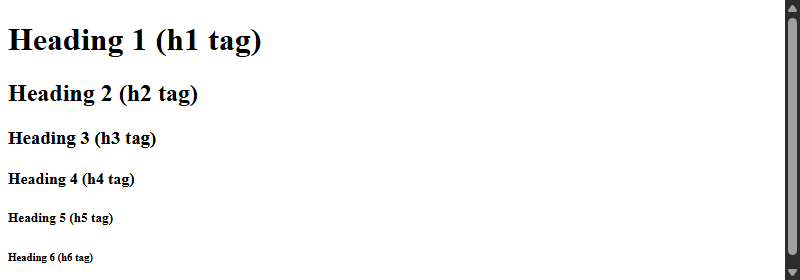

[← Back to README](../README.md) · [Next: Structuring with Containers →](step-04-containers.md)

# Step 3: Formatting Text

Now that we have our document skeleton ready, let's start adding visible text content to our page. To do this, we will use headings and paragraph tags.

Since you are building a website about yourself, we will write a personal name heading and an introductory bio paragraph.

---

## Headings (`<h1>` to `<h6>`)

HTML headings are used to define the titles and subtitles of a page. There are six levels of headings, starting from `<h1>` (the most important) to `<h6>` (the least important).

* **`<h1>`:** Typically used for the main title of the page (like your name).
* **`<h2>`:** Used for major sections (like "About Me" or "My Skills").
* **`<h3>` to `<h6>`:** Used for sub-sections.

### Code Example:
```html
<h1>Jane Doe</h1>
<h2>About Me</h2>
```

### Browser Sizing Preview:
Below is a browser rendering of how each heading level `<h1>` through `<h6>` displays by default, so you can see their relative sizes and styling:



---

## Paragraphs (`<p>`)

The `<p>` tag is used to define a paragraph of text. Browsers automatically add some space (margin) before and after each `<p>` element.

### Code Example:
```html
<p>Welcome to my simple personal space on the web. I build clean, structured websites.</p>
---

## Formatting Text (`<em>` and `<strong>`)

To style text without using layout tools, we use inline styling tags:
* **`<em>` (Emphasis):** Displays the text in *italics*.
* **`<strong>` (Strong):** Displays the text in **bold**.

### Code Example:
```html
<p><em>Creative Developer & Tech Explorer</em></p>
<p>I focus on <strong>standard web technologies</strong> to make pages clear.</p>
```

---

## Browser Render of the Text Tags

Below is a screenshot of what this text looks like when rendered in a web browser:


---

## Complete Step Code

Here is the complete state of your `index.html` file at the end of this step:

```html
<!DOCTYPE html>
<html>
  <head>
    <meta charset="utf-8">
    <title>Jane Doe - Profile</title>
  </head>
  <body>
    <h1>Jane Doe</h1>
    <p><em>Creative Developer & Tech Explorer</em></p>
    <p>Welcome to my simple personal space on the web. I build clean, structured websites.</p>
    
    <h2>About Me</h2>
    <p>I focus on <strong>standard web technologies</strong> to make information accessible, clean, and elegant. Here is a breakdown of what I do:</p>
  </body>
</html>
```

---

[← Back to README](../README.md) · [Next: Structuring with Containers →](step-04-containers.md)
