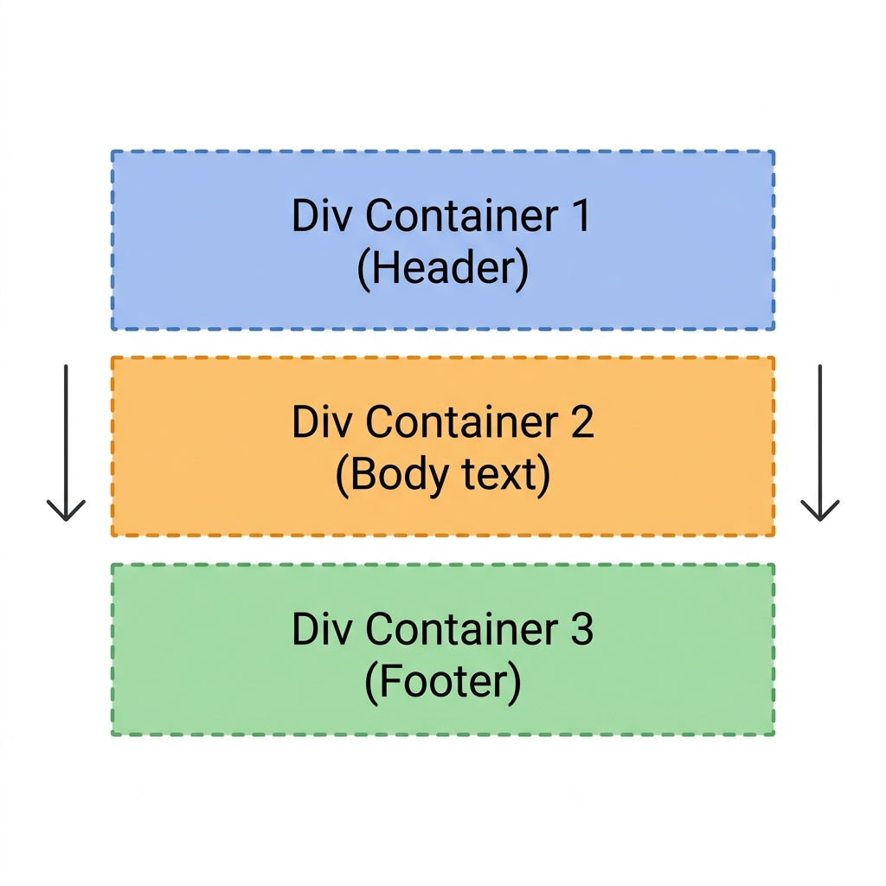

[← Back to README](../README.md) · [Next: Adding Links & Images →](step-05-links-images.md)

# Step 4: Structuring with Containers

As your webpage grows, you will need a way to group and organize related pieces of content together. In HTML, this is done using **container elements**. 

The most common container tag is the **`<div>`** tag.

---

## What is a `<div>`?

The **`<div>`** (short for "division") element is an empty container used to group block-level content together. 
* It is a **block-level element**, meaning it starts on a new line and occupies the entire width of the page.
* By default, a `<div>` has **no visual styling** (it is completely invisible). Its only job is to bundle tags together so that they act as one single section.

---

## Stacking Containers

Think of `<div>` tags as invisible boxes stacked on top of each other. Below is a diagram illustrating this concept:



Grouping text in sections makes the document structure logical and ready for future CSS layout rules.

---

## Code Example: Grouping Your Profile Sections

Let's use `<div>` containers to organize your personal website into two main sections: a **header block** and an **about block**.

```html
<!-- Header Section -->
<div>
  <h1>Jane Doe</h1>
  <p>Web Developer & Learner</p>
</div>

<!-- About Section -->
<div>
  <h2>About Me</h2>
  <p>I enjoy learning new technologies and coding simple web apps.</p>
</div>
```

---

## Hands-On Exercise

Let's organize your `index.html` file using `<div>` tags.

Update your `index.html` file with this code block:

```html
<!DOCTYPE html>
<html>
  <head>
    <title>My Organized Profile</title>
  </head>
  <body>

    <!-- Header Section -->
    <div>
      <h1>Jane Doe</h1>
      <p>Beginner Web Developer</p>
    </div>

    <!-- Details Section -->
    <div>
      <h2>About Me</h2>
      <p>I am starting my coding journey by learning plain HTML structure.</p>
      <p>I want to create websites that are easy to read and well-organized.</p>
    </div>

  </body>
</html>
```

### Steps to Test:
1. Copy the code block above into your `index.html` file.
2. Replace the name and details with your own personal info.
3. Save the file and refresh your browser.
4. Notice that even though the page looks very similar to before, the tags are now neatly grouped in sections behind the scenes.

---

[← Back to README](../README.md) · [Next: Adding Links & Images →](step-05-links-images.md)
