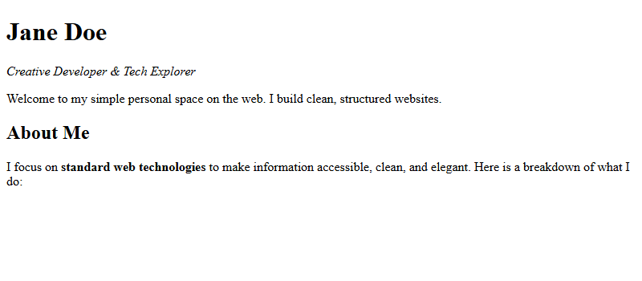

[← Back to README](../README.md) · [Next: Adding Links & Images →](step-05-links-images.md)

# Step 4: Structuring with Containers

As your webpage grows, you will need a way to group and organize related pieces of content together. In HTML, this is done using **container elements**. 

The most common container tag is the **`<div>`** tag.

---

## What is a `<div>`?

The **`<div>`** (short for "division") element is an empty container used to group block-level content together. 
* It is a **block-level element**, meaning it starts on a new line and occupies the entire width of the page.
* By default, a `<div>` has **no visual styling** (it is completely invisible). Its only job is to bundle tags together so that they act as one single section.

---

## Stacking Containers

Think of `<div>` tags as invisible boxes stacked on top of each other. Below is a diagram illustrating this concept:


### Browser Rendering (Invisible Structure)

Because `<div>` containers are completely invisible by default, adding them does **not** change the visual look of the webpage in the browser. It will look identical to the previous step:



Grouping text in sections makes the document structure logical and ready for future CSS layout rules.

---

## Code Example: Grouping Your Profile Sections

Let's use `<div>` containers to organize your personal website into two main sections: a **header block** and an **about block**.

```html
<!-- Header Section -->
<div>
  <h1>Jane Doe</h1>
  <p><em>Creative Developer & Tech Explorer</em></p>
  <p>Welcome to my simple personal space on the web. I build clean, structured websites.</p>
</div>

<!-- About Section -->
<div>
  <h2>About Me</h2>
  <p>I focus on <strong>standard web technologies</strong> to make information accessible, clean, and elegant. Here is a breakdown of what I do:</p>
</div>
```

---

## Complete Step Code

Here is the complete state of your `index.html` file at the end of this step:

```html
<!DOCTYPE html>
<html>
  <head>
    <meta charset="utf-8">
    <title>Jane Doe - Profile</title>
  </head>
  <body>

    <!-- Header Section -->
    <div>
      <h1>Jane Doe</h1>
      <p><em>Creative Developer & Tech Explorer</em></p>
      <p>Welcome to my simple personal space on the web. I build clean, structured websites.</p>
    </div>

    <!-- About Section -->
    <div>
      <h2>About Me</h2>
      <p>I focus on <strong>standard web technologies</strong> to make information accessible, clean, and elegant. Here is a breakdown of what I do:</p>
    </div>

  </body>
</html>
```

---

[← Back to README](../README.md) · [Next: Adding Links & Images →](step-05-links-images.md)
