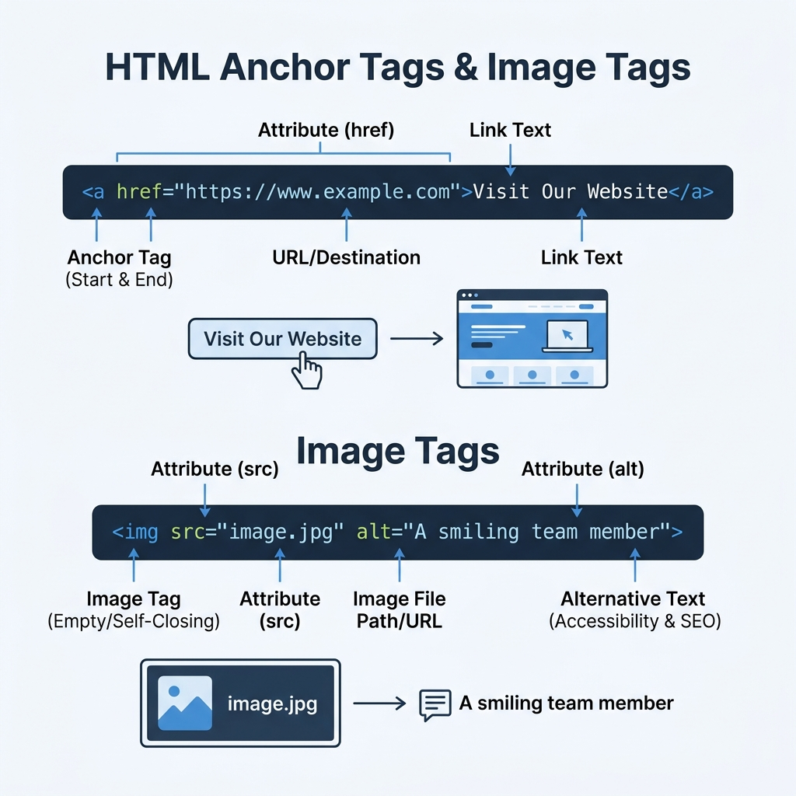
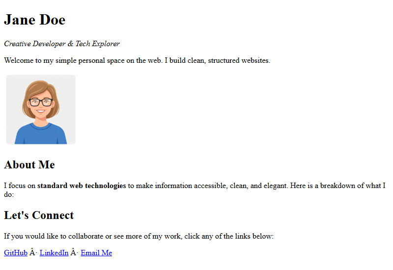

[← Back to README](../README.md) · [Next: Final Practical Project →](step-06-practice.md)

# Step 5: Adding Links & Images

A text-only website is a good start, but the web is interactive and visual! In this step, you will learn how to connect pages using links and display images.

---

## 1. Adding Hyperlinks (`<a>`)

To link to another webpage, we use the **`<a>`** tag (which stands for **anchor**).
* It requires the **`href`** attribute (hypertext reference), which specifies the web address you want to visit.
* The text that the user clicks on goes between the opening `<a>` and closing `</a>` tags.

### Code Example:
```html
<a href="https://github.com">Visit my GitHub</a>
```

---

## 2. Embedding Images (``)

To show a picture on your page, we use the **``** tag.
* It is a **self-closing tag**, meaning it doesn't need a closing `</img>` tag.
* It requires the **`src`** attribute (source), which specifies the path or URL to the image file.
* It also requires the **`alt`** attribute (alternative text), which describes the image for screen readers or if the image fails to load.

### Code Example:
```html

```

## Visual Explanation & Browser Render

Below is an infographic explaining how anchor attributes and image tags work:



### Browser Rendering

Here is what the code for this step looks like when rendered in the browser, showing the profile image placeholder and the clickable link anchors:



---

## Complete Step Code

Here is the complete state of your `index.html` file at the end of this step:

```html
<!DOCTYPE html>
<html>
  <head>
    <meta charset="utf-8">
    <title>Jane Doe - Profile</title>
  </head>
  <body>

    <!-- Header Section -->
    <div>
      <h1>Jane Doe</h1>
      <p><em>Creative Developer & Tech Explorer</em></p>
      <p>Welcome to my simple personal space on the web. I build clean, structured websites.</p>
    </div>

    <!-- Profile Image Section -->
    <div>
      
    </div>

    <!-- About Me Section -->
    <div>
      <h2>About Me</h2>
      <p>I focus on standard web technologies to make information accessible, clean, and elegant. Here is a breakdown of what I do:</p>
    </div>

    <!-- Connect & Links Section -->
    <div>
      <h2>Let's Connect</h2>
      <p>If you would like to collaborate or see more of my work, click any of the links below:</p>
      <p>
        <a href="https://github.com">GitHub</a> · 
        <a href="https://linkedin.com">LinkedIn</a> · 
        <a href="mailto:jane@example.com">Email Me</a>
      </p>
    </div>

  </body>
</html>
```

---

[← Back to README](../README.md) · [Next: Final Practical Project →](step-06-practice.md)
