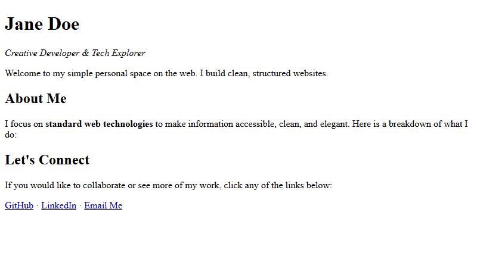

[← Step 5: Containers](step-05-containers.md) · [Next: Embedding Images →](step-07-images.md)

# Step 6: Adding Links

Webpages are interconnected. We use hyperlinks to connect our site to other pages or resources.

## Hyperlinks (`<a>`)

To link to another webpage, we use the **`<a>`** tag (which stands for **anchor**).
* It requires the **`href`** attribute, which specifies the destination web address.
* The clickable text is placed between `<a>` and `</a>`.

---

## Code Example

```html
<a href="https://github.com">GitHub</a>
```

---

## Complete Step Code

Add a contact footer section at the bottom of your code using the HTML entity `&middot;` to separate the links:

```html
<!DOCTYPE html>
<html>
  <head>
    <meta charset="utf-8">
    <title>Jane Doe - Profile</title>
  </head>
  <body>

    <!-- Header Section -->
    <div>
      <h1>Jane Doe</h1>
      <p><em>Creative Developer & Tech Explorer</em></p>
      <p>Welcome to my simple personal space on the web. I build clean, structured websites.</p>
    </div>

    <!-- About Section -->
    <div>
      <h2>About Me</h2>
      <p>I focus on <strong>standard web technologies</strong> to make information accessible, clean, and elegant. Here is a breakdown of what I do:</p>
    </div>

    <!-- Connect & Links Section -->
    <div>
      <h2>Let's Connect</h2>
      <p>If you would like to collaborate or see more of my work, click any of the links below:</p>
      <p>
        <a href="https://github.com">GitHub</a> &middot; 
        <a href="https://linkedin.com">LinkedIn</a> &middot; 
        <a href="mailto:jane@example.com">Email Me</a>
      </p>
    </div>

  </body>
</html>
```

---

## Browser Output



---

[← Step 5: Containers](step-05-containers.md) · [Next: Embedding Images →](step-07-images.md)
