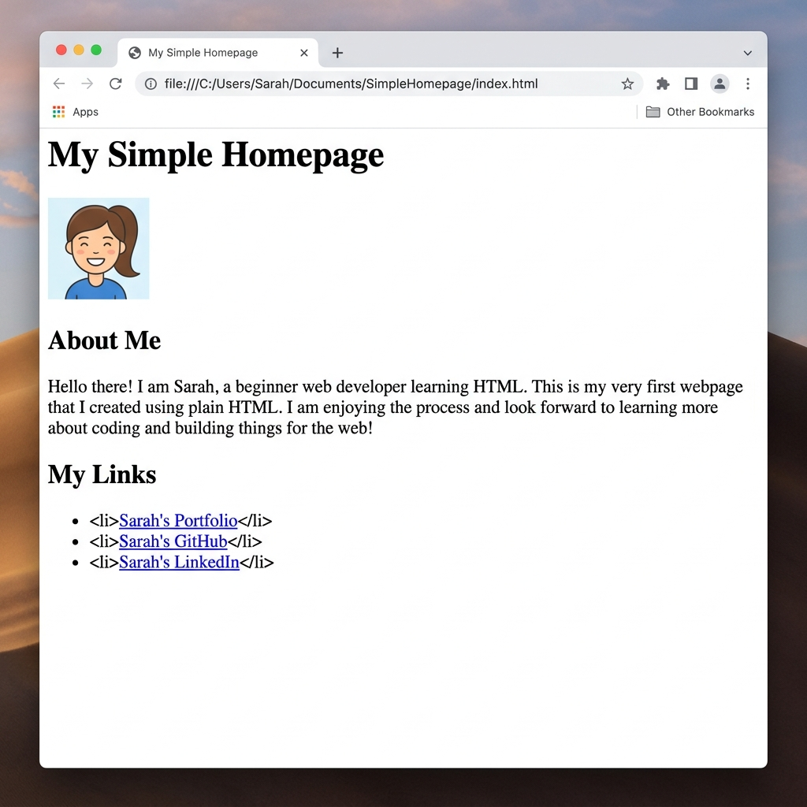

[← Back to README](../README.md)

# Step 6: Final Practical Project

Congratulations on making it to the final step! You have learned the basic structure and layout tools of HTML. 

Now, it is time to combine everything into a complete, clean personal homepage that describes who you are.

---

## What the Webpage Will Look Like

Below is a preview of the final webpage rendered in a browser. It is unstyled, clean, standard HTML:



---

## Final Project Code Block

Copy this complete code block and use it to replace all contents inside your `index.html` file. Make sure to replace the placeholder information (like names, bio texts, and links) with details about yourself.

```html
<!DOCTYPE html>
<html>
  <head>
    <title>My Personal Profile</title>
  </head>
  <body>

    <!-- Header / Brand Section -->
    <div>
      <h1>Alex Developer</h1>
      <p>Student, Creator & Web Enthusiast</p>
    </div>

    <hr> <!-- A simple horizontal line divider -->

    <!-- Profile Image Section -->
    <div>
      <!-- A placeholder profile avatar image -->
      
    </div>

    <!-- About Me Section -->
    <div>
      <h2>About Me</h2>
      <p>
        Hi! I am Alex. I am currently learning how to build things on the web. I started my coding journey today by learning plain HTML tags.
      </p>
      <p>
        My goal is to learn CSS next so I can add colors, layouts, and styles to my structures, and eventually build full interactive applications!
      </p>
    </div>

    <!-- Hobbies Section -->
    <div>
      <h2>My Hobbies & Interests</h2>
      <p>
        When I am not coding, I enjoy reading science fiction, playing keyboard, hiking in nature, and experimenting with new recipes in the kitchen.
      </p>
    </div>

    <!-- Links & Contact Section -->
    <div>
      <h2>Connect With Me</h2>
      <p>Feel free to reach out or look at my work:</p>
      <p>
        <a href="https://github.com">View my GitHub Projects</a>
      </p>
      <p>
        <a href="https://linkedin.com">Connect on LinkedIn</a>
      </p>
      <p>
        <a href="mailto:alex@example.com">Send me an Email</a>
      </p>
    </div>

  </body>
</html>
```

---

## Wrap-Up & Next Steps

You've built your very first webpage! You now know how to:
1. Initialize an HTML document.
2. Structure information with invisible section divs.
3. Form headers and write paragraph texts.
4. Render pictures and build clickable web links.

### What is Next?
HTML represents the **bones** of a website. To make websites look modern, colorful, and styled, your next step is to learn **CSS (Cascading Style Sheets)**.

---

[← Back to README](../README.md)
