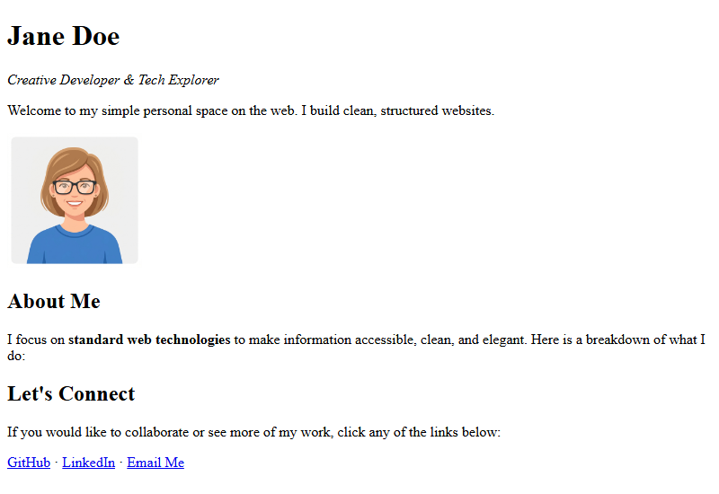

[← Step 6: Links](step-06-links.md) · [Next: Final Practice Project →](step-08-practice.md)

# Step 7: Embedding Images

Now we will embed a visual profile picture on our page and control its size using attributes.

## Embedding Images (``)

We use the **``** tag to embed images:
* It is a **self-closing tag** (no closing `</img>` is needed).
* It requires the **`src`** attribute (the path to the image file).
* It requires the **`alt`** attribute (alternative text description).
* It supports **`width`** and **`height`** attributes to resize the image display.

---

## Visual Explanation

Below is an infographic explaining how attributes work inside the anchor and image tags:


---

## Complete Step Code

Add the image section under your header block, sizing it explicitly to `150` pixels width and height:

```html
<!DOCTYPE html>
<html>
  <head>
    <meta charset="utf-8">
    <title>Jane Doe - Profile</title>
  </head>
  <body>

    <!-- Header Section -->
    <div>
      <h1>Jane Doe</h1>
      <p><em>Creative Developer & Tech Explorer</em></p>
      <p>Welcome to my simple personal space on the web. I build clean, structured websites.</p>
    </div>

    <!-- Profile Image Section -->
    <div>
      
    </div>

    <!-- About Me Section -->
    <div>
      <h2>About Me</h2>
      <p>I focus on <strong>standard web technologies</strong> to make information accessible, clean, and elegant. Here is a breakdown of what I do:</p>
    </div>

    <!-- Connect & Links Section -->
    <div>
      <h2>Let's Connect</h2>
      <p>If you would like to collaborate or see more of my work, click any of the links below:</p>
      <p>
        <a href="https://github.com">GitHub</a> &middot; 
        <a href="https://linkedin.com">LinkedIn</a> &middot; 
        <a href="mailto:jane@example.com">Email Me</a>
      </p>
    </div>

  </body>
</html>
```

---

## Browser Output



---

[← Step 6: Links](step-06-links.md) · [Next: Final Practice Project →](step-08-practice.md)
