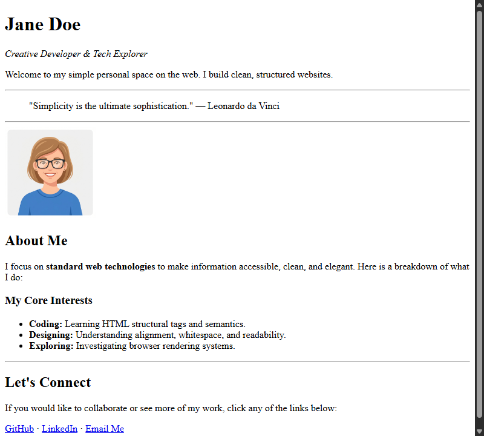

[← Step 7: Images](step-07-images.md) · [Next: Tables →](step-09-tables.md)

# Step 8: Lists & Quotes

In this step, we will make our page look more premium by adding visual divider lines, blockquote headers, and bulleted lists.

## New Tags Introduced

* <strong>`<hr>` (Horizontal Rule):</strong> Creates a simple horizontal divider line across the page. It is a self-closing tag.
* <strong>`<blockquote>`:</strong> Indents a block of text, ideal for callouts, personal mottos, or famous quotes.
* <strong>`<ul>` (Unordered List):</strong> Creates a bulleted list of items.
* <strong>`<li>` (List Item):</strong> Defines each item inside the bullet list.

---

## Code Example: Bullet Lists

To create a list, nest your `<li>` tags inside a parent `<ul>` container:

```html
<h3>My Core Interests</h3>
<ul>
  <li><strong>Coding:</strong> Learning HTML structural tags.</li>
  <li><strong>Designing:</strong> Understanding visual alignment.</li>
</ul>
```

---

## Complete Step Code

Add dividers, the blockquote, and the bulleted list under your "About Me" section:

```html
<!DOCTYPE html>
<html>
  <head>
    <meta charset="utf-8">
    <title>Jane Doe - Profile</title>
  </head>
  <body>
    <div>
      <div>
        <h1>Jane Doe</h1>
        <p><em>Creative Developer & Tech Explorer</em></p>
        <p>Welcome to my simple personal space on the web. I build clean, structured websites.</p>
      </div>
      <hr>
      <div>
        <blockquote>
          "Simplicity is the ultimate sophistication." &mdash; Leonardo da Vinci
        </blockquote>
      </div>
      <hr>
      <div>
        
      </div>
      <div>
        <h2>About Me</h2>
        <p>
          I focus on <strong>standard web technologies</strong> to make information accessible, clean, and elegant. Here is a breakdown of what I do:
        </p>
        <h3>My Core Interests</h3>
        <ul>
          <li><strong>Coding:</strong> Learning HTML structural tags and semantics.</li>
          <li><strong>Designing:</strong> Understanding alignment, whitespace, and readability.</li>
          <li><strong>Exploring:</strong> Investigating browser rendering systems.</li>
        </ul>
      </div>
      <hr>
      <div>
        <h2>Let's Connect</h2>
        <p>If you would like to collaborate or see more of my work, click any of the links below:</p>
        <p>
          <a href="https://github.com">GitHub</a> &middot; 
          <a href="https://linkedin.com">LinkedIn</a> &middot; 
          <a href="mailto:jane@example.com">Email Me</a>
        </p>
      </div>
    </div>
  </body>
</html>
```

---

## Browser Output



---

[← Step 7: Images](step-07-images.md) · [Next: Tables →](step-09-tables.md)
