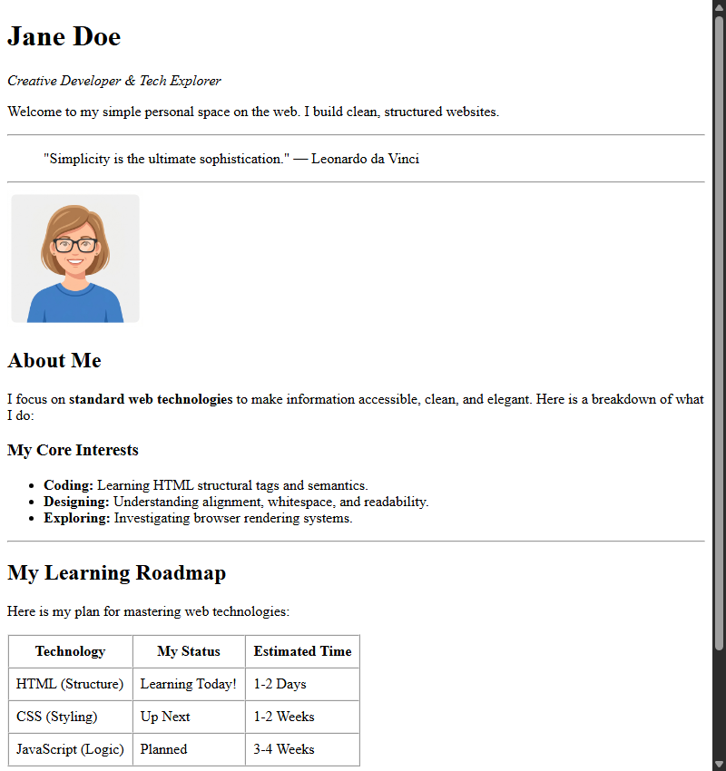

[← Step 8: Lists & Quotes](step-08-lists.md) · [Next: Final Project →](step-10-practice.md)

# Step 9: Tables

In this step, we will learn how to present structured, tabular information using HTML tables.

## Table Tags

* <strong>`<table>`:</strong> The parent container that defines the grid.
* <strong>`<thead>`:</strong> Groups the header content at the top of the table.
* <strong>`<tbody>`:</strong> Groups the body content/rows of the table.
* <strong>`<tr>` (Table Row):</strong> Defines a single row of cells.
* <strong>`<th>` (Table Header):</strong> Defines a header cell (renders bold and centered by default).
* <strong>`<td>` (Table Data):</strong> Defines a standard content cell.

## Table Attributes

To style the table purely in HTML, we use these attributes:
* <strong>`border="1"`:</strong> Draws borders around cells.
* <strong>`cellpadding="8"`:</strong> Adds visual padding space inside each cell.
* <strong>`cellspacing="0"`:</strong> Merges cell borders together for a clean grid look.

---

## Code Example

```html
<table border="1" cellpadding="8" cellspacing="0">
  <thead>
    <tr>
      <th>Technology</th>
      <th>Status</th>
    </tr>
  </thead>
  <tbody>
    <tr>
      <td>HTML</td>
      <td>Learning!</td>
    </tr>
  </tbody>
</table>
```

---

## Complete Step Code

Add the learning roadmap table under your interests block:

```html
<!DOCTYPE html>
<html>
  <head>
    <meta charset="utf-8">
    <title>Jane Doe - Profile</title>
  </head>
  <body>
    <div>
      <div>
        <h1>Jane Doe</h1>
        <p><em>Creative Developer & Tech Explorer</em></p>
        <p>Welcome to my simple personal space on the web. I build clean, structured websites.</p>
      </div>
      <hr>
      <div>
        <blockquote>
          "Simplicity is the ultimate sophistication." &mdash; Leonardo da Vinci
        </blockquote>
      </div>
      <hr>
      <div>
        
      </div>
      <div>
        <h2>About Me</h2>
        <p>
          I focus on <strong>standard web technologies</strong> to make information accessible, clean, and elegant. Here is a breakdown of what I do:
        </p>
        <h3>My Core Interests</h3>
        <ul>
          <li><strong>Coding:</strong> Learning HTML structural tags and semantics.</li>
          <li><strong>Designing:</strong> Understanding alignment, whitespace, and readability.</li>
          <li><strong>Exploring:</strong> Investigating browser rendering systems.</li>
        </ul>
      </div>
      <hr>
      <div>
        <h2>My Learning Roadmap</h2>
        <p>Here is my plan for mastering web technologies:</p>
        <table border="1" cellpadding="8" cellspacing="0">
          <thead>
            <tr>
              <th>Technology</th>
              <th>My Status</th>
              <th>Estimated Time</th>
            </tr>
          </thead>
          <tbody>
            <tr>
              <td>HTML (Structure)</td>
              <td>Learning Today!</td>
              <td>1-2 Days</td>
            </tr>
            <tr>
              <td>CSS (Styling)</td>
              <td>Up Next</td>
              <td>1-2 Weeks</td>
            </tr>
            <tr>
              <td>JavaScript (Logic)</td>
              <td>Planned</td>
              <td>3-4 Weeks</td>
            </tr>
          </tbody>
        </table>
      </div>
      <hr>
      <div>
        <h2>Let's Connect</h2>
        <p>If you would like to collaborate or see more of my work, click any of the links below:</p>
        <p>
          <a href="https://github.com">GitHub</a> &middot; 
          <a href="https://linkedin.com">LinkedIn</a> &middot; 
          <a href="mailto:jane@example.com">Email Me</a>
        </p>
      </div>
    </div>
  </body>
</html>
```

---

## Browser Output



---

[← Step 8: Lists & Quotes](step-08-lists.md) · [Next: Final Project →](step-10-practice.md)
