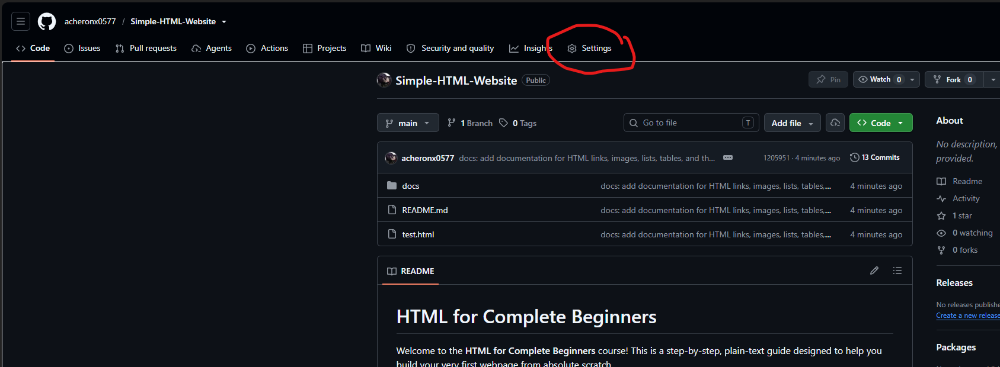
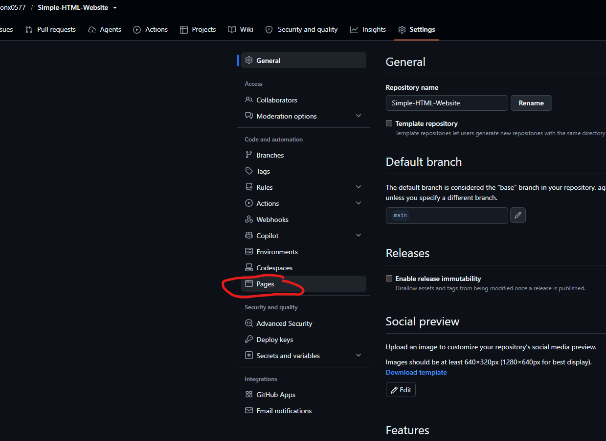
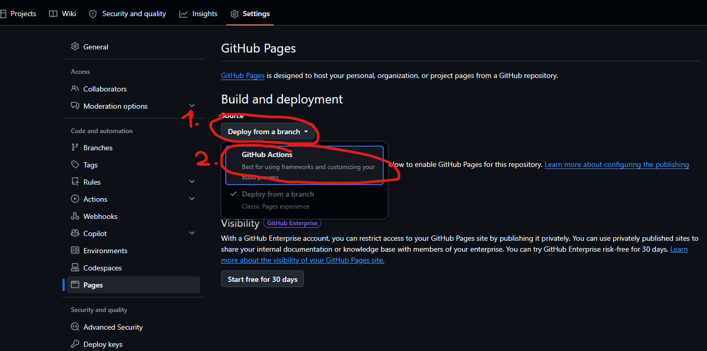
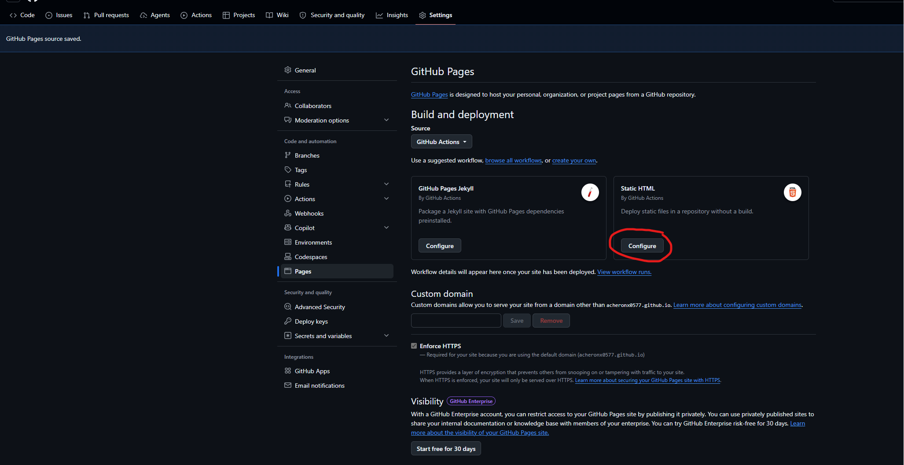
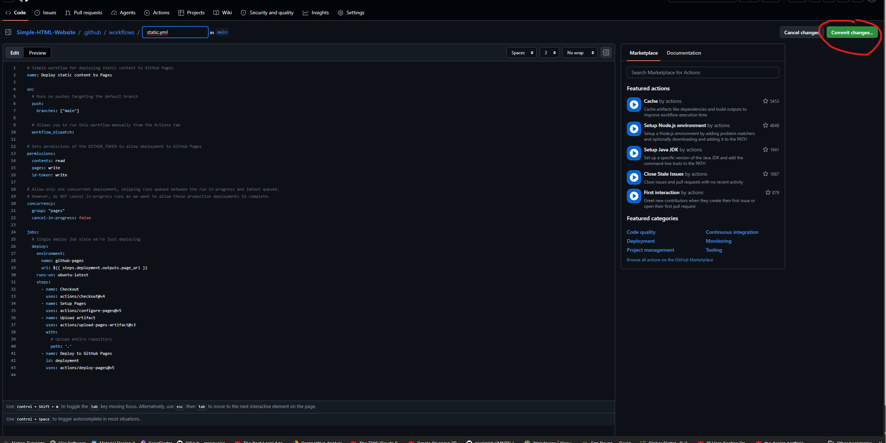
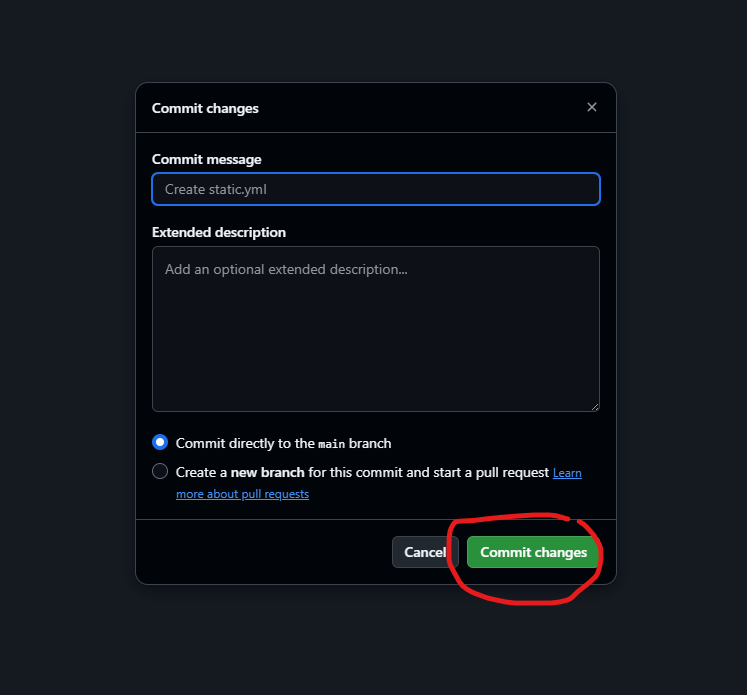
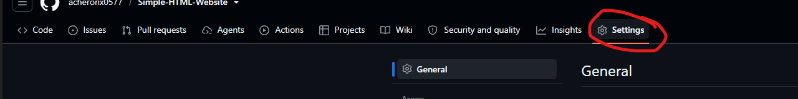
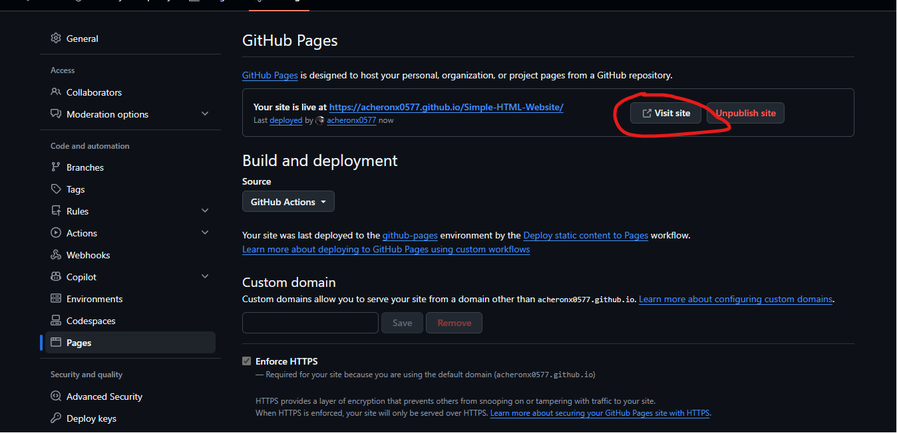

[← Step 10: Final Practical Project](step-10-practice.md) · [Back to README](../README.md)

# Step 11: Hosting & Git

Now that you have built your first webpage, let's learn how to host it on the internet for free so your friends, family, or potential employers can view it!

To do this, we will use two essential tools:
* **Git**: A tool that tracks changes in your code (version control).
* **GitHub**: A platform that hosts your Git projects online.
* **GitHub Pages**: A free service by GitHub that turns your code repository into a live, public website.

---

## 1. Why `index.html`?

Web servers are designed to look for a default entry file when someone visits a web address (like `https://example.com`). 
By convention, this entry file must be named **`index.html`**.

> [!IMPORTANT]
> If you named your file `test.html` or `myprofile.html`, you must rename it to **`index.html`** before uploading it to GitHub. Otherwise, the web server won't know which file to load first, and visitors will get an error!

### How to rename it:
1. Find your webpage file in your computer's file explorer or in your text editor.
2. Rename it exactly to `index.html` (all lowercase).

---

## 2. Setting Up Git on Your Machine

Before sending code to GitHub, you need Git installed and configured.

### Step A: Install Git
If you don't have Git installed yet:
1. Download Git from [git-scm.com](https://git-scm.com/) and install it.
2. Open your terminal (Command Prompt on Windows, Terminal on macOS).

### Step B: Configure Git (One-time Setup)
Run these commands in your terminal to set your identity (replace with your actual name and email):
```bash
git config --global user.name "Your Name"
git config --global user.email "your.email@example.com"
```

### Step C: Initialize Your Local Repository
Navigate to your project folder in your terminal and initialize Git:
```bash
# Initialize a new Git repository in this folder
git init

# Add all your files (including index.html) to the staging area
git add .

# Save your changes with a message
git commit -m "First commit: Create index.html"
```

---

## 3. Creating a GitHub Repository

Now, let's create a home for your project on GitHub.

1. Go to [github.com](https://github.com) and log in (or sign up).
2. Click the **New** button (or **Create repository**).
3. Name your repository something simple, like `my-first-website`.
4. Ensure the repository is **Public** (GitHub Pages requires public repositories for free accounts).
5. Leave "Add a README file", "Add .gitignore", and "Choose a license" **unchecked** (since we already have our files).
6. Click **Create repository**.

---

## 4. Connecting Local Git to GitHub

After creating the repository, GitHub will show you a page with some terminal commands. Follow these commands to upload (push) your code:

```bash
# Rename the default branch to 'main'
git branch -M main

# Link your local folder to the GitHub repository (replace with your repository's URL)
git remote add origin https://github.com/your-username/my-first-website.git

# Upload your code to GitHub
git push -u origin main
```

> [!NOTE]
> When running `git push`, your computer might ask you to log in or authenticate with GitHub. Follow the prompts on your screen to complete the login.

---

## 5. Hosting Your Site with GitHub Pages (Via GitHub Actions)

Once your code is pushed to GitHub, we can set up **GitHub Pages** to automatically host your website using **GitHub Actions**. Follow these 8 visual steps to deploy your site:

### Step 1: Open Repository Settings
Go to your repository page on GitHub and click on the **Settings** tab in the top navigation bar.


### Step 2: Go to the Pages Section
In the left sidebar, scroll down to the **Code and automation** section and click on **Pages**.


### Step 3: Switch Source to GitHub Actions
Under the **Build and deployment** section, locate the **Source** dropdown (which defaults to *Deploy from a branch*) and change it to **GitHub Actions**.


### Step 4: Configure the Static HTML Workflow
Under the suggested workflows that appear, find the **Static HTML** box and click its **Configure** button.


### Step 5: Start Committing the Workflow File
A text editor will open with a pre-configured `static.yml` workflow file. Do not edit the text; simply click the green **Commit changes...** button in the top right.


### Step 6: Confirm the Commit
A modal dialog will pop up. Leave "Commit directly to the main branch" selected, and click the green **Commit changes** button at the bottom.


### Step 7: Return to Settings
After committing, wait about 1 minute for GitHub Actions to automatically run and publish your site. To check the status, click on the **Settings** tab at the top again.


### Step 8: Visit Your Live Website!
Go back to **Pages** in the left sidebar. At the top of the page, you will now see a box showing that your site is live. Click the **Visit site** button to open your webpage in a new tab!


---

## Wrap-Up & Next Steps

You did it! Your website is live and accessible to anyone in the world. 

If you make changes to your `index.html` in the future, you can update your live site by running these commands in your project folder:
```bash
git add .
git commit -m "Updated profile bio"
git push
```

Now that your site is live, you can start learning **CSS** to style it and make it look beautiful!

---

[← Step 10: Final Practical Project](step-10-practice.md) · [Back to README](../README.md)
